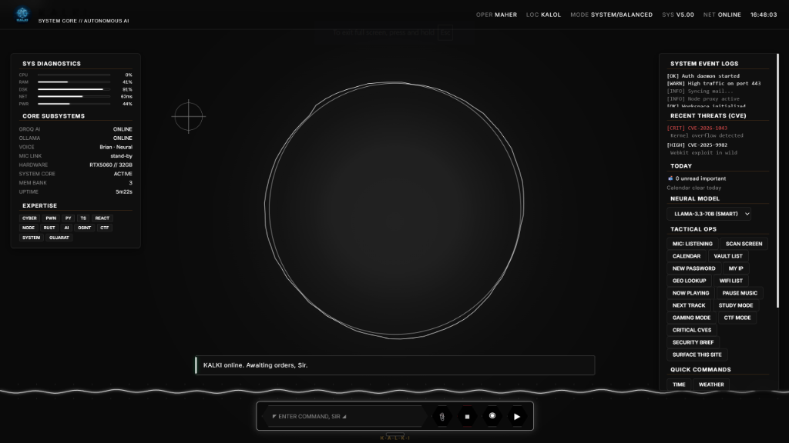
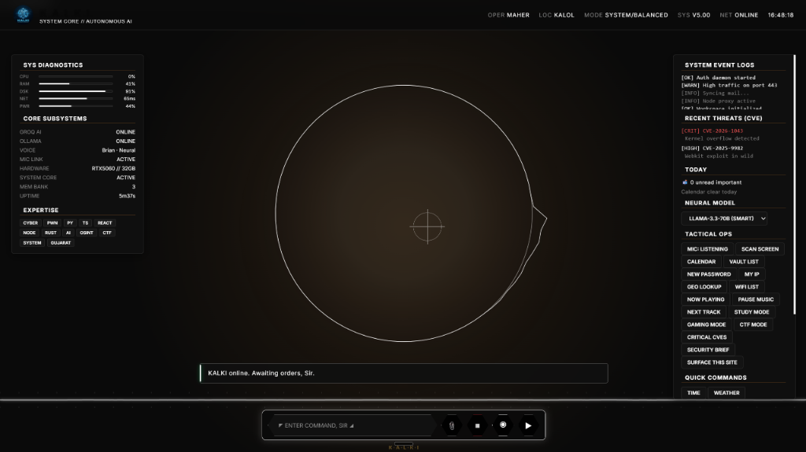

# K.A.L.K.I.
### *Autonomous AI Personal Assistant — v5*

A Windows-native, voice-first AI assistant inspired by J.A.R.V.I.S. from Iron Man — built from scratch in Python and a single HTML file. Wakes on **"Hey KALKI"**, speaks in a neural voice, and manages your life through a sleek sci-fi HUD.


> The HUD is **state-reactive** — the interface retunes as KALKI idles, listens, thinks, and speaks.

| Standby | Listening |
|:---:|:---:|
|  |  |

---

## What's New in v5

- 🖥️ **OS Control** — Lock PC, mute audio, empty recycle bin, open VS Code by voice
- 🤖 **Proactive Alerts** — KALKI interrupts you when urgent email arrives or GitHub has new notifications
- 🐙 **GitHub Integration** — Check your GitHub notifications by voice
- 🛰 **Shodan OSINT** — *"Scan IP 8.8.8.8"* pulls open ports, CVEs, org info from Shodan
- 📋 **Clipboard AI Coding** — Copy broken code, say *"Fix the code in my clipboard"* — KALKI fixes and pastes it back
- 📧 **Mark Emails as Read** — *"Mark all emails as read"* — stops the repeat notifications instantly
- 🎙 **Mic auto-fix** — `start_jarvis.bat` auto-selects the correct Python 3.11 environment with full audio support

---

## Highlights

- 🎙 **Voice-first, always-on** — "Hey KALKI" wake word; cloud STT with optional **offline Vosk** engine
- 🧠 **Smart model routing** — fast 8B for casual turns, LLaMA-3.3-70B for code/cyber. **Offline fallback** to local Ollama
- 🔐 **Web vulnerability scanner** — reads your open browser tab, audits TLS/headers/cookies/CORS/XSS/injections
- 🛰 **Site Watchdog** — background monitor: down/recovered alerts + SSL-expiry warnings
- 📋 **Clipboard genie** — auto-detects JWT / base64 / hex / hashes
- 🌅 **Morning security brief** — new critical CVEs + watched-site status on every boot
- ⚡ **No build step** — pure Python + one HTML file. Clone and run

---

## Features

### Voice & Intelligence
- **Always-on wake-word** — say "Hey KALKI" from anywhere, even with browser tab closed
- **Groq-powered brain** — `llama-3.3-70b-versatile` for thinking, `llama-4-scout` for vision
- **Neural TTS** — Microsoft edge-tts `en-GB-RyanNeural`
- **Stop command** — say "stop" anywhere to cut speech instantly

### Personal Assistant
- **Google Calendar** — speaks today's/tomorrow's events on boot
- **Auto event reminders** — warns 15 minutes before every meeting, unprompted
- **Gmail** — reads important unread mail; ignores promotions/social/spam
- **Mark emails as read** — *"Mark all emails as read"* clears your inbox via IMAP
- **Tasks + reminders** — natural language: *"remind me to X in 10 minutes"*
- **Notes + journal** — *"take a note"*, *"what did I note yesterday"*, `#tags` auto-parsed
- **Password vault** — DPAPI-encrypted, Windows user-account locked
- **WhatsApp messaging** — *"Send a WhatsApp to Dev saying I'll be late"*
- **Spotify control** — play, pause, next, volume, now playing
- **Workflow modes** — study/gaming/CTF/focus trigger multi-step action chains

### OS & System Control *(New in v5)*
- **Lock PC** — *"Lock my PC"*
- **Mute audio** — *"Mute audio"* / *"Toggle mute"*
- **Empty Recycle Bin** — *"Empty the recycle bin"*
- **Open VS Code** — *"Open Visual Studio Code"*
- **Clipboard AI Coding** — copy buggy code → *"Fix the code in my clipboard"* → paste fixed code

### Cybersecurity Toolkit
- **Web scanner** — full audit: TLS, headers, cookies, CORS, XSS, injections, secrets
- **Hashes** — identify, generate (MD5/SHA1/SHA256/SHA512/NTLM), dictionary-crack
- **Encode/decode** — base64, hex, URL, rot13, binary, morse
- **CVE intel** — `lookup CVE-2024-3094` and *"recent critical CVEs"* (last 30 days)
- **Subdomain enumeration** — crt.sh + hackertarget fallback
- **GitHub dorking** — pre-baked search URLs for leaked keys, .env, SSH keys
- **Shodan OSINT** *(New)* — *"Scan IP x.x.x.x"* — open ports, vulns, org from Shodan API
- **Reverse shell payloads** — Bash, Python, PowerShell, PHP, Perl, Ruby, nc
- **Port scan / DNS / WHOIS / HTTP headers / Ping**
- **WiFi password recovery** — via `netsh wlan show profile`

### GitHub Integration *(New in v5)*
- **Check notifications** — *"Check my GitHub"* or *"Any GitHub notifications?"*
- Proactive alert if new GitHub notifications arrive while you work

### Proactive Alerts *(Upgraded in v5)*
- **Urgent email** — KALKI interrupts you: *"Excuse me Sir, you have a new urgent email"*
- **GitHub notifications** — alerts when new notifications arrive
- **Battery** — speaks at <20% and <10%
- **CPU** — sustained high (>95% for 3 checks)
- **RAM** — over 90%
- All alerts have cooldowns to avoid spam

### The HUD
- **Arc reactor** — 60fps canvas, 72 mic-reactive bars, 32 orbiting particles, rotating text rings
- **State-reactive theme** — UI shifts hue when idle/listening/thinking/speaking
- **Live panels** — CPU/RAM/disk/network/power, calendar, unread mail, now-playing track
- **Code blocks** — rendered in monospace with one-click COPY button

---

## Architecture

```
                ┌─────────────────────────┐
                │   index.html (the HUD)  │
                │   Canvas + JS + CSS     │
                └──────────┬──────────────┘
                           │ /api/* HTTP+JSON
                           ▼
   ┌───────────────────────┴──────────────────────────┐
   │                  server.py                       │
   │  http.server + ThreadingMixIn (stdlib only)      │
   │  - intent router (800+ local commands)           │
   │  - background loops (alerts, calendar, reminders)│
   │  - voice TTS pipeline (edge-tts + pygame)        │
   └─┬──┬──┬──┬──┬──┬──┬──┬──┬──┬──┬──┬──┬──┬───────┘
     │  │  │  │  │  │  │  │  │  │  │  │  │  │
   vault gcal vision coder spotify whatsapp notes tasks
   cybertools workflows mail ytdl github_mod shodan_mod
                           ▲
                           │ POST /api/wake|chat|stop
                           │
                ┌──────────┴──────────────┐
                │      listener.py        │
                │  SpeechRecognition+PyAudio│
                │  cycles mic, fuzzy match│
                └─────────────────────────┘

   start_jarvis.bat → launches server + listener on Python 3.11
   launcher.py      → silent boot, registers HKCU\...\Run
```

---

## Project Structure

```
C:\Kalki\
├── server.py            ← HTTP API + intent router + background loops
├── listener.py          ← Always-on wake word + follow-up listener
├── launcher.py          ← Silent boot + Windows autostart
├── config.py            ← All keys & settings (gitignored)
├── config.example.py    ← Template — copy to config.py and fill in
├── index.html           ← The HUD (canvas + vanilla JS)
├── requirements.txt     ← pip dependencies
├── INSTALL.bat          ← One-click installer
├── START.bat            ← Manual launch (console visible for debugging)
├── start_jarvis.bat     ← Recommended launcher (auto Python 3.11 + mic)
│
│   ── Core Modules ──
├── vault.py             ← DPAPI password store
├── cybertools.py        ← Hashes, codecs, network, CVE, recon, payloads
├── vision.py            ← Screenshot / image analysis via Groq vision
├── coder.py             ← Code generation + execution sandbox
├── tasks.py             ← Tasks + reminders
├── notes.py             ← Notes + journal
├── mail.py              ← IMAP Gmail (check + mark as read)
├── gcal.py              ← Google Calendar + Gmail OAuth
├── spotify_mod.py       ← Spotify Web API control
├── whatsapp_mod.py      ← pywhatkit messaging
├── workflows.py         ← Multi-step modes
├── clipboard_mod.py     ← Clipboard read/write + AI code fix
├── webscan.py           ← Full web vulnerability scanner
├── deepscan.py          ← Deep Playwright-powered site scanner
├── semantic_memory.py   ← Long-term AI memory
├── runtime_security.py  ← Runtime security monitoring
├── ytdl.py              ← yt-dlp wrapper
│
│   ── New in v5 ──
├── github_mod.py        ← GitHub notifications integration
├── shodan_mod.py        ← Shodan OSINT / IP scanner
│
│   ── One-time setup ──
├── setup_google.py      ← Google OAuth
├── setup_spotify.py     ← Spotify OAuth
├── setup_startup.py     ← Windows autostart registration
│
└── data/                ← Local state (gitignored)
    ├── memory.json
    ├── tasks.json
    ├── notes.json
    ├── vault.json           (DPAPI-encrypted)
    ├── google_token.pickle
    └── scripts/
```

---

## Setup

### Method 1: The Installer (Recommended)
The easiest way to get KALKI running is to use the standalone installer. This avoids installing Python and running commands manually.
1. Go to the [Releases](https://github.com/Maher-Bhatt/KALKI/releases) page.
2. Download `KALKI_Setup.exe` (v5.1.0 or latest).
3. Run the installer and follow the Setup Wizard. 

---

### Method 2: Manual Installation (For developers)

#### Requirements
- **Windows 10/11**
- **Python 3.11** — install from [python.org](https://www.python.org/downloads/release/python-3119/) and tick **"Add Python to PATH"**
- A **microphone**
- A **free Groq API key** (takes 1 minute)

---

#### Step 1 — Get your free Groq API key

KALKI's brain runs on [Groq](https://console.groq.com) (free, very fast LLaMA inference).

1. Go to **<https://console.groq.com>** and sign in
2. Open **API Keys** → **Create API Key**
3. Copy the key (looks like `gsk_xxxx`) — you only see it once

> 🔒 Keep this key private. Never commit it to GitHub.

---

#### Step 2 — Clone & configure

```bat
git clone https://github.com/Maher-Bhatt/KALKI.git C:\Kalki
cd C:\Kalki
copy config.example.py config.py
```

Open **`config.py`** and fill in your details:

```python
GROQ_API_KEY   = "gsk_your_key_here"
OWNER_NAME     = "YourName"
OWNER_CITY     = "YourCity"

# Optional — for new v5 features
GITHUB_TOKEN   = "your_github_personal_access_token"
SHODAN_API_KEY = "your_shodan_api_key"
```

> ⚠️ **`config.py` is gitignored** — your keys stay on your machine only.

---

### Step 3 — Install & run

```bat
INSTALL.bat          :: installs all Python dependencies
start_jarvis.bat     :: launches KALKI (recommended)
```

KALKI opens in your browser at `http://localhost:8888`. Say **"Hey KALKI"** to begin.

**Auto-start on boot (optional):**
```bat
py -3.11 setup_startup.py
```

---

### Step 4 — Optional integrations

| Integration | Setup |
|---|---|
| **Google Calendar + Gmail** | [console.cloud.google.com](https://console.cloud.google.com) → enable Calendar + Gmail API → OAuth credentials → `py -3.11 setup_google.py` |
| **Spotify** | [developer.spotify.com](https://developer.spotify.com/dashboard) → create app → redirect URI `http://127.0.0.1:8889/callback` → paste Client ID + Secret in `config.py` → `py -3.11 setup_spotify.py` |
| **GitHub** | Create a Personal Access Token at [github.com/settings/tokens](https://github.com/settings/tokens) → paste in `config.py` as `GITHUB_TOKEN` |
| **Shodan** | Get a free API key at [shodan.io](https://shodan.io) → paste in `config.py` as `SHODAN_API_KEY` |
| **Offline brain** | Install [Ollama](https://ollama.com) → `ollama pull qwen2.5:7b` |
| **Tesseract OCR** | Install from [UB-Mannheim](https://github.com/UB-Mannheim/tesseract/wiki) |

---

## Voice Command Reference

### New in v5
| Say | Action |
|---|---|
| "Lock my PC" | Locks Windows instantly |
| "Mute audio" / "Toggle mute" | Mutes system audio |
| "Empty the recycle bin" | Clears recycle bin silently |
| "Open Visual Studio Code" | Launches VS Code |
| "Fix the code in my clipboard" | AI fixes your copied code, pastes back |
| "Mark all emails as read" | Marks every unread Gmail as read via IMAP |
| "Check my GitHub" | Reads unread GitHub notifications |
| "Scan IP 8.8.8.8" | Shodan OSINT report on that IP |

### Music & Media
| Say | Action |
|---|---|
| "Play lo-fi" | Spotify search + play |
| "Pause" / "Resume" | Playback control |
| "Next song" / "Previous song" | Skip / back |
| "What's playing" | Speaks current track |
| "Download this YouTube video \<url\>" | yt-dlp |

### Productivity
| Say | Action |
|---|---|
| "What's on my calendar" | Today's events |
| "Check my Gmail" | Important unread mail |
| "Mark all emails as read" | Clears inbox notifications |
| "Add task X" / "Show my tasks" | Task management |
| "Remind me to X in 10 minutes" | Timed reminder |
| "Take a note Y" / "Show my notes" | Notes journal |
| "Send a WhatsApp to Dev..." | WhatsApp Web message |

### Cybersecurity
| Say | Action |
|---|---|
| "MD5 of admin123" | Hash it |
| "Crack hash \<hash\>" | Dictionary attack |
| "Lookup CVE-2024-3094" | NVD lookup |
| "Recent critical CVEs" | Last 30 days |
| "Find subdomains of paypal.com" | crt.sh recon |
| "Scan IP 1.2.3.4" | Shodan OSINT *(New)* |
| "Reverse shell python 10.0.0.1 4444" | Payload generator |
| "Port scan 192.168.1.1" | Top 42 TCP ports |
| "What's my IP" | Public IP + geolocation |
| "WiFi password for HomeNet" | `netsh` recovery |

### System Control
| Say | Action |
|---|---|
| "Lock my PC" | Windows lock *(New)* |
| "Mute audio" | Mute system *(New)* |
| "Empty the recycle bin" | Clear bin *(New)* |
| "Open Visual Studio Code" | Launch VS Code *(New)* |
| "Battery" / "System info" | psutil stats |
| "Take a screenshot" | Saves to Desktop |
| "Sleep" / "Restart" / "Shutdown" | Windows power commands |

### Vault & Vision
| Say | Action |
|---|---|
| "Save my Gmail password as X" | DPAPI vault |
| "What is my Gmail password" | Retrieve from vault |
| "Look at my screen and solve it" | Screenshot → Groq vision |
| "Fix the code in my clipboard" | AI clipboard coding *(New)* |

### Workflow Modes
| Say | What runs |
|---|---|
| "Study mode" | Opens Code, lo-fi playlist, lowers volume |
| "Gaming mode" | Opens Steam + Discord, kills Chrome |
| "CTF mode" | Opens Code, terminal, exploit-db, gtfobins |
| "Focus mode" | Lowers volume, kills Discord |
| "Morning routine" | Opens Gmail + Calendar |

---

## Tech Stack

| Layer | Tech |
|---|---|
| Server | Python 3.11 stdlib (`http.server` + `ThreadingMixIn`) — no Flask |
| LLM | Groq API (`llama-3.3-70b-versatile` / `llama-4-scout` vision) |
| TTS | Microsoft edge-tts + pygame mixer (non-blocking) |
| STT | SpeechRecognition + PyAudio + Google STT |
| Calendar/Mail | google-api-python-client + google-auth-oauthlib + imaplib |
| Music | spotipy (Spotify Web API) |
| Messaging | pywhatkit (WhatsApp Web) |
| Vault | pywin32 / `win32crypt` (DPAPI) |
| System | psutil, pycaw, pillow, comtypes, ctypes |
| OSINT | Shodan API, crt.sh, NVD API, hackertarget.com |
| GitHub | GitHub REST API v3 |
| Frontend | Vanilla JS + Canvas2D, single `index.html`, no build step |

---

## License

MIT — see [LICENSE](LICENSE).

---

## Acknowledgments

- Inspired by Tony Stark's J.A.R.V.I.S. from the MCU
- [Groq](https://groq.com) for blazing-fast LLaMA inference
- [edge-tts](https://github.com/rany2/edge-tts) for the neural voice
- [crt.sh](https://crt.sh) and [NVD](https://nvd.nist.gov) for free security data

---

> *"Sometimes you gotta run before you can walk."* — Tony Stark
