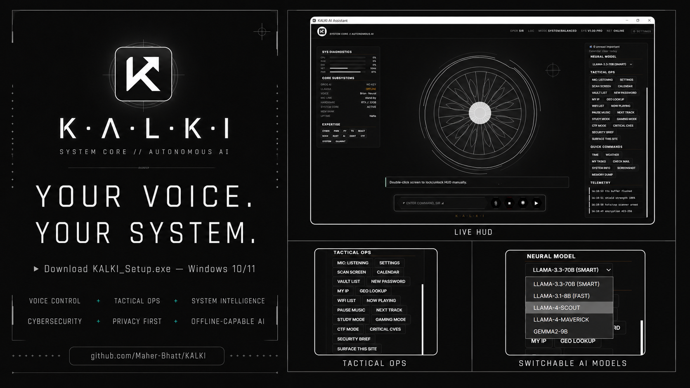
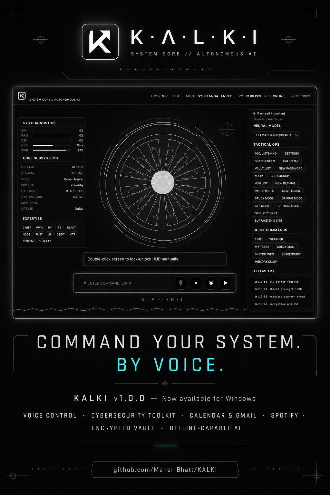
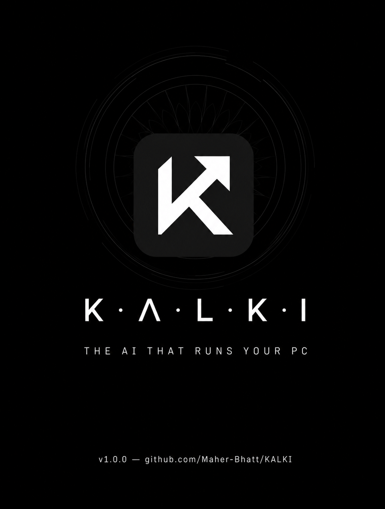
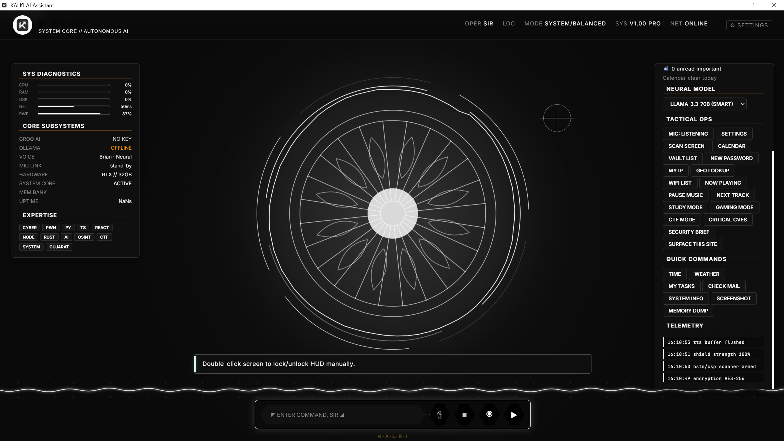
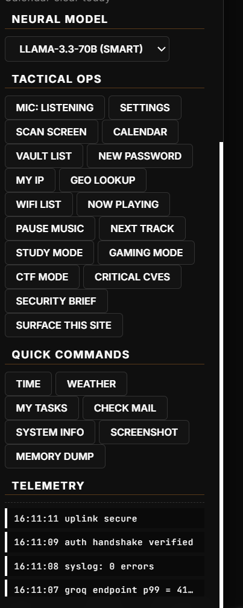
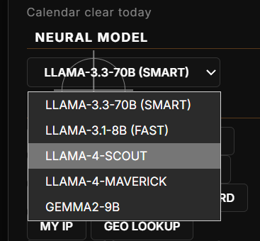
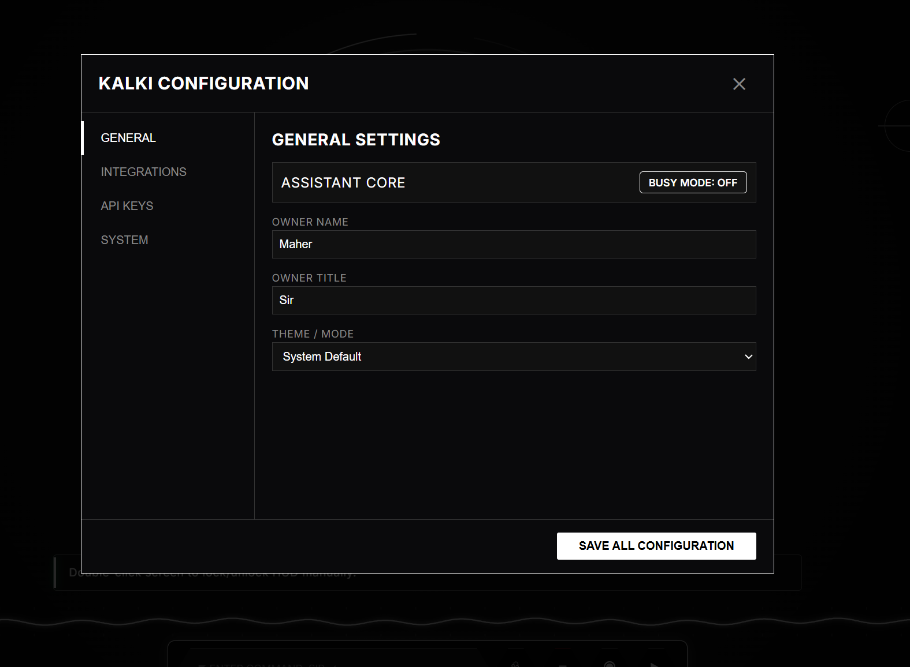
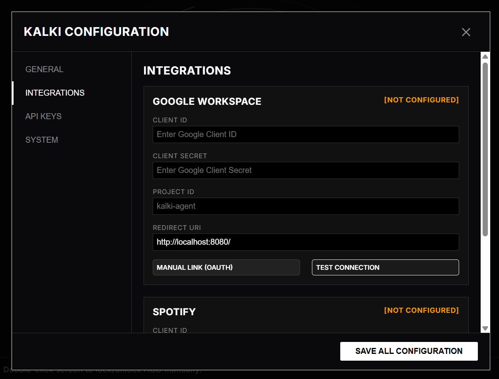

  

  <h1> KALKI</h1>

  <strong>The Ultimate Windows-Native, Voice-First AI Assistant</strong> 
  <em>Inspired by Tony Stark's J.A.R.V.I.S., engineered for modern developers and power users.</em>

  

    
    
    
    
  

  <h3><a href="https://github.com/Maher-Bhatt/KALKI/releases">⬇️ Download the latest KALKI_Setup.exe</a></h3>

---

## 📢 Latest Release: v1.0.3 Adaptive UI & Stability Update

**KALKI v1.0.3** introduces a massive architectural overhaul designed to make the platform feel like a premium, enterprise-grade desktop application.

*   **Adaptive Display Engine 2.0:** Completely constraint-based layout utilizing dynamic REM scaling. The futuristic HUD now natively adapts to any resolution, viewport, or DPI setting without layout breakage.
*   **Audio Pipeline 2.0 (Zero Echo):** The background voice listener now aggressively flushes `pyaudio` buffers during TTS output. KALKI will *never* transcribe its own voice feedback loop again.
*   **Developer Diagnostics Dashboard:** Press `Ctrl + Shift + D` to reveal a hidden telemetry overlay tracking real-time FPS, Memory, DevicePixelRatio, UI Scale, and Audio Latency.
*   **Core Architectural Modularity:** The monolithic backend has been safely decoupled into a dedicated `core` Python package, isolating global states and laying the foundation for v1.1.0.
*   **Professional Windows Build:** Executables are now natively injected with proper `KALKI Technologies` publisher and copyright metadata.

---

## 🌌 Welcome to the Future of Desktop AI

**KALKI** is an autonomous, lightning-fast personal AI assistant engineered entirely from the ground up using pure Python and an embedded, state-reactive Vanilla JS Heads-Up Display (HUD). 

Designed to completely bypass the standard clunky chat interfaces, KALKI lives on your machine, wakes on the command **"Hi KALKI"**, and manages your system, tasks, and cybersecurity workflows entirely via voice.

---

## ✨ Enterprise-Grade Features

### 🎙️ Voice-First, Always-On
*   **Zero-Friction Wake:** Say **"Hi KALKI"** from across the room. KALKI will instantly capture your command without needing a single mouse click.
*   **Intelligent Audio Pipeline:** Advanced signal processing prevents feedback loops and ensures KALKI never misinterprets its own voice output.
*   **Offline Fallback:** Features optional offline VOSK Wake-Word detection for low-latency, privacy-focused interactions.

### 🧠 Cognitive Routing (Multi-Model Architecture)
*   **Instant Responses:** Casual tasks are routed to a blazing-fast `LLaMA-3.1-8B` model.
*   **Deep Reasoning:** Complex coding, debugging, and cybersecurity queries are dynamically offloaded to the heavy `LLaMA-3.3-70B-Versatile` or `LLaMA-4-SCOUT` vision models.
*   **Full Offline Autonomy:** Completely drop the cloud and run KALKI entirely on your local GPU via Ollama.

### 🛡️ Tactical Cybersecurity Toolkit
*   **Deep Webscan Engine:** Voice-trigger a Chromium headless instance to audit URLs for missing security headers.
*   **Shodan OSINT:** Pull real-time IP intelligence directly into the HUD.
*   **CVE Intel & Port Scanning:** Stay ahead of vulnerabilities with live NVD tracking and integrated port mappers.

### 💻 Clipboard AI Coding
*   Copy broken or messy code, press your shortcut, and say *"Fix the code in my clipboard."* KALKI will instantly rewrite it, optimize it, and paste it back into your IDE seamlessly.

### 🤖 True System Integration
*   **PC Control:** Lock the screen, toggle volume, clear recycle bins, or open VS Code directly via voice.
*   **Life Management:** Full integration with Google Calendar, Gmail, Reminders, and a DPAPI-encrypted password vault.
*   **Adaptive UI:** Fluid, resolution-agnostic scaling ensures the futuristic HUD looks incredible on anything from a 1080p laptop to a massive 4K monitor.

---

## 🚀 Installation & Setup

KALKI requires **zero manual build steps**. 

1. **Download:** Navigate to the [Releases](https://github.com/Maher-Bhatt/KALKI/releases) page.
2. **Install:** Run `KALKI_Setup.exe` (v1.0.3 or newer). The wizard will seamlessly install the core engine, the deepscan Chromium browser, and all offline assets.
3. **Configure:** A free API key from [Groq](https://groq.com) is required to power the cloud LLaMA brain. Add it to the integrated settings panel.
4. **Launch:** Say *"Hi KALKI"* and welcome your new assistant online.

---

## 💻 System Requirements

### Minimum Requirements (Cloud AI Mode)
*   **OS:** Windows 10 or Windows 11 (64-bit)
*   **CPU:** Intel Core i3 / AMD Ryzen 3
*   **RAM:** 4 GB DDR4
*   **Storage:** 2 GB SSD space
*   **Peripherals:** Working Microphone and Speakers

### Recommended Requirements (Local Offline Mode)
*Required to run the heavy LLaMA parameters completely locally without Groq.*
*   **CPU:** Intel Core i5 / AMD Ryzen 5 or better
*   **RAM:** 16 GB+ System Memory 
*   **GPU:** NVIDIA RTX 3060 / AMD RX 6600 (VRAM 8GB+ minimum for hardware acceleration)
*   **Storage:** 15 GB+ available NVMe SSD space

---

## 📐 Architecture overview

KALKI strictly separates its "Brain" from its visual "Body" to ensure the interface never locks up while the AI is computing.

1. **The HUD Frontend (`index.html`):** A masterpiece of standalone Vanilla JavaScript and Canvas2D. It polls the local backend at 60Hz, painting real-time audio waveforms, dynamic telemetry, and tactical scanning data.
2. **The Server Core (`server.py`):** A multi-threaded HTTP server built on Python's standard library. It processes incoming telemetry requests, manages local memory state, and orchestrates API calls.
3. **The Listener Daemon (`listener.py`):** An isolated audio background thread running VOSK/Google Speech-to-Text. It intercepts the user's voice and routes the transcribed text payload straight into the Cognitive Router.

---

## 📸 Visual Showcase

  
  

 

  

 

  
  

 

  
  

---

## 🛠️ Technology Stack

| Component | Framework / Implementation |
| :--- | :--- |
| **HUD / Frontend** | Vanilla JavaScript + HTML5 Canvas2D |
| **Backend Core** | Pure Python 3.11 (`http.server` & `ThreadingMixIn`) |
| **Cognitive Engine** | Groq API (`llama-3.3-70b-versatile` / `llama-3.1-8b`) |
| **Audio Pipeline** | Microsoft `edge-tts`, `pygame` mixer, Google STT |
| **Integrations** | `google-api-python-client`, `imaplib`, `spotipy` |
| **System Interaction**| `psutil`, `pycaw`, `pillow`, Windows DPAPI via `win32crypt` |
| **Cyber Recon** | Playwright, Shodan API, `crt.sh`, NVD Database |

---

## 📜 License & Credits

KALKI is licensed under the **MIT License**. See the `LICENSE` file for full details.

**Special Thanks:**
*   [Groq](https://groq.com) for their unprecedented LLaMA inference speeds.
*   The developers behind [edge-tts](https://github.com/rany2/edge-tts).

> *"Sometimes you gotta run before you can walk."* - Tony Stark
