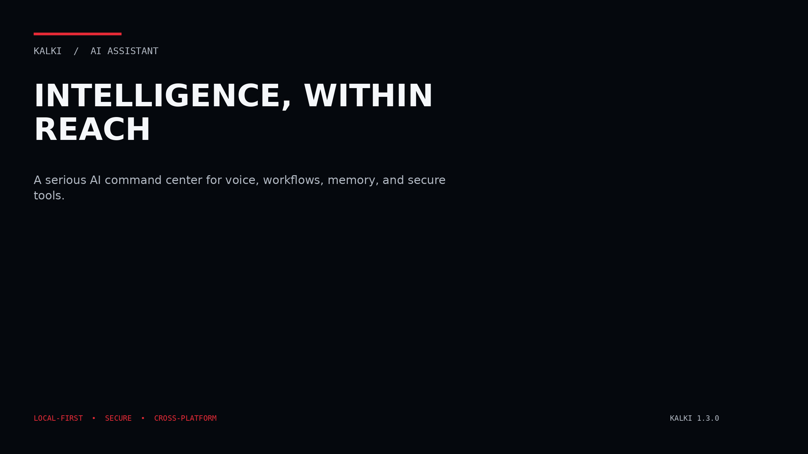
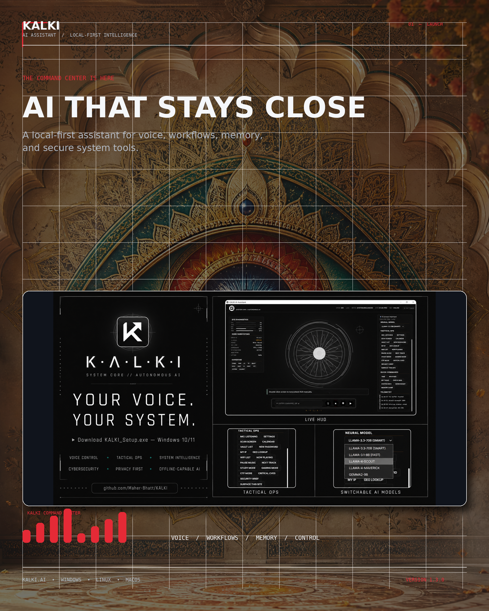
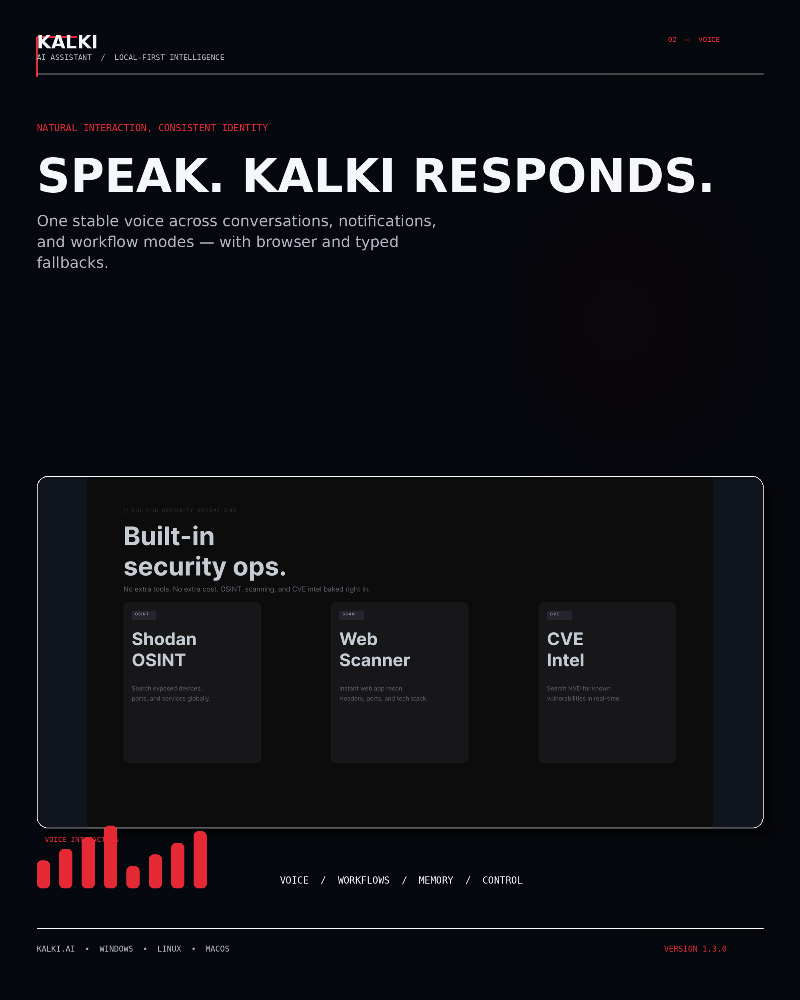
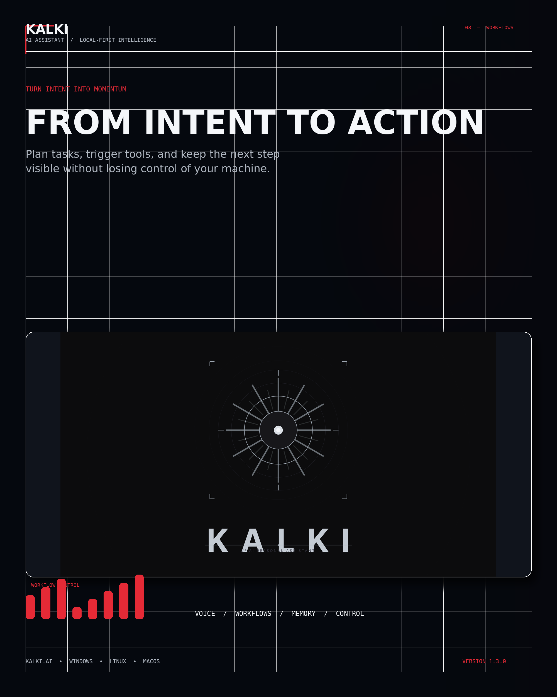
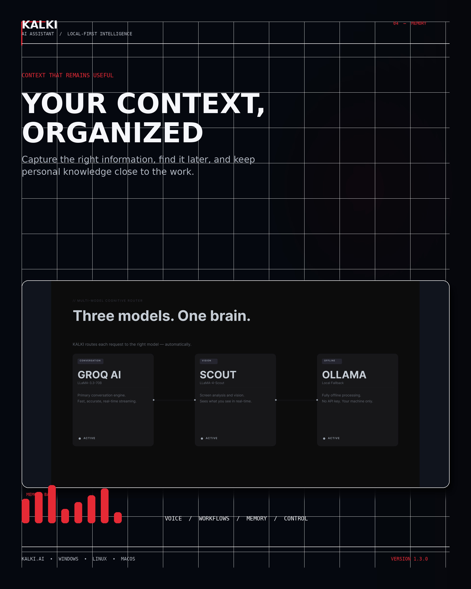
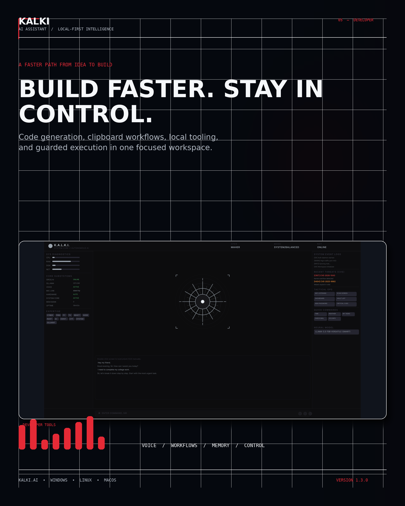
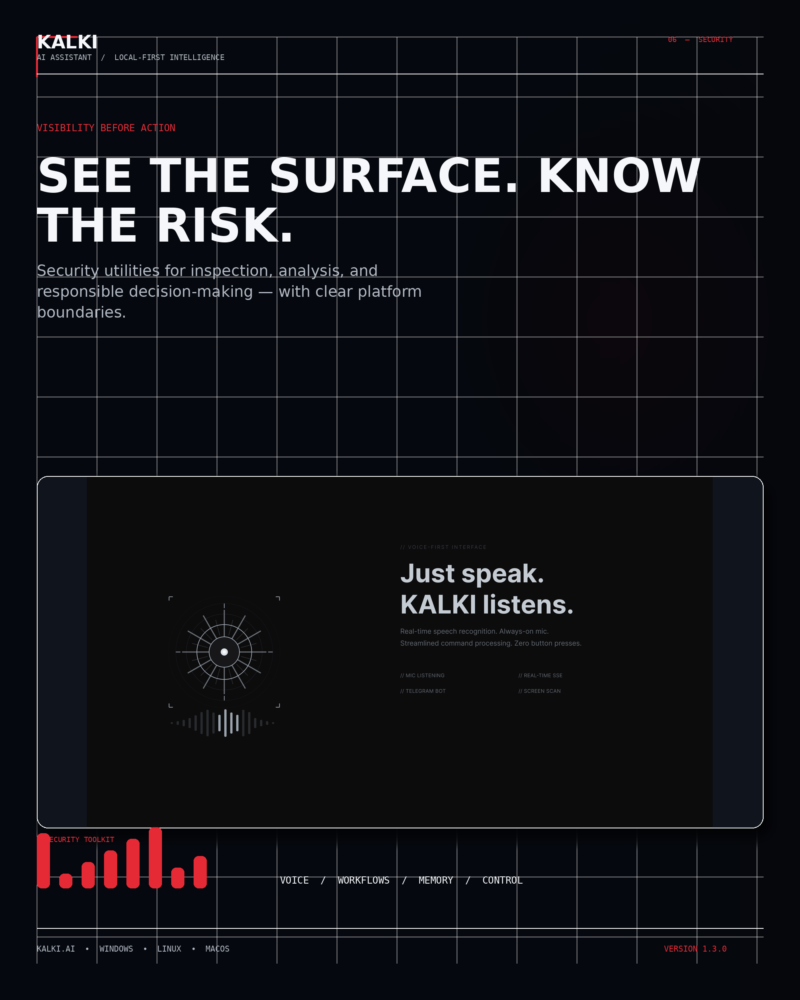
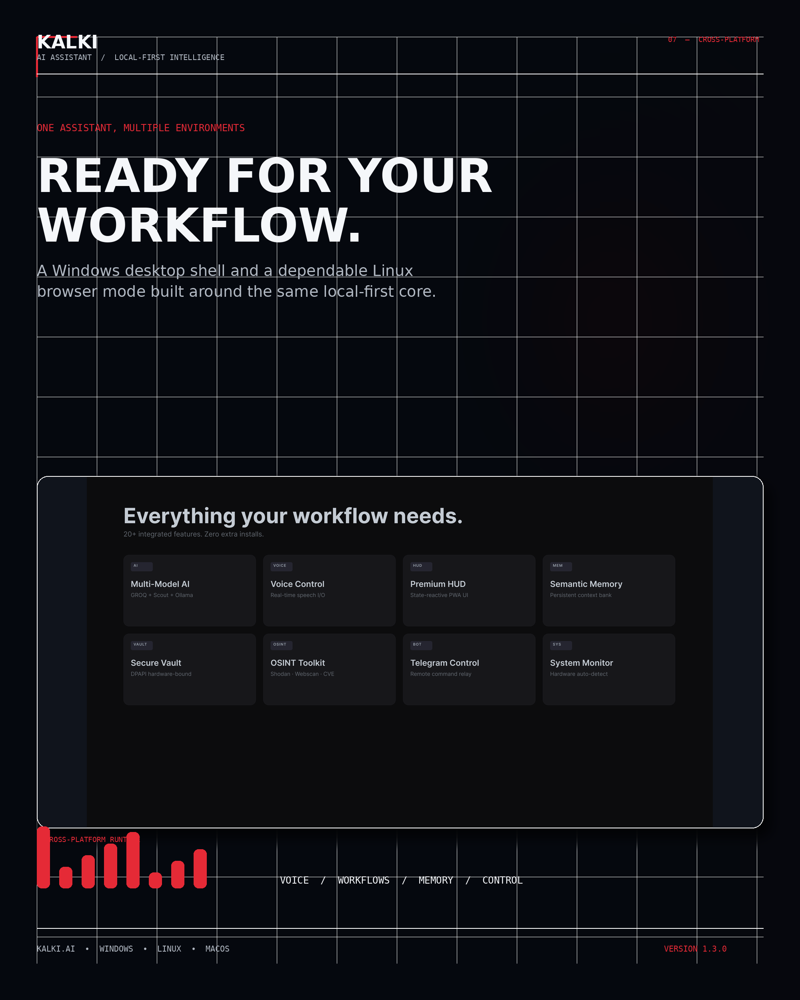
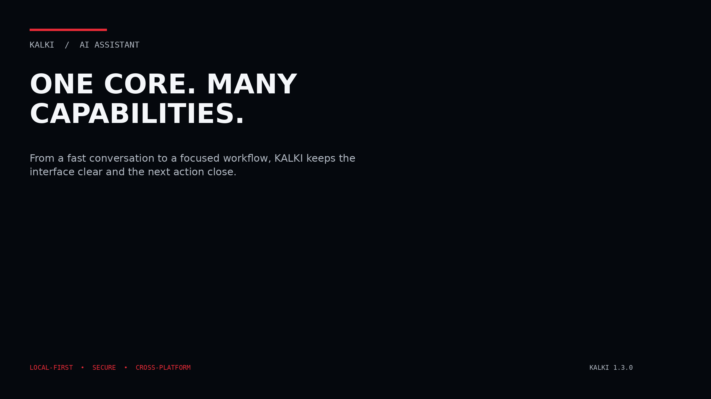
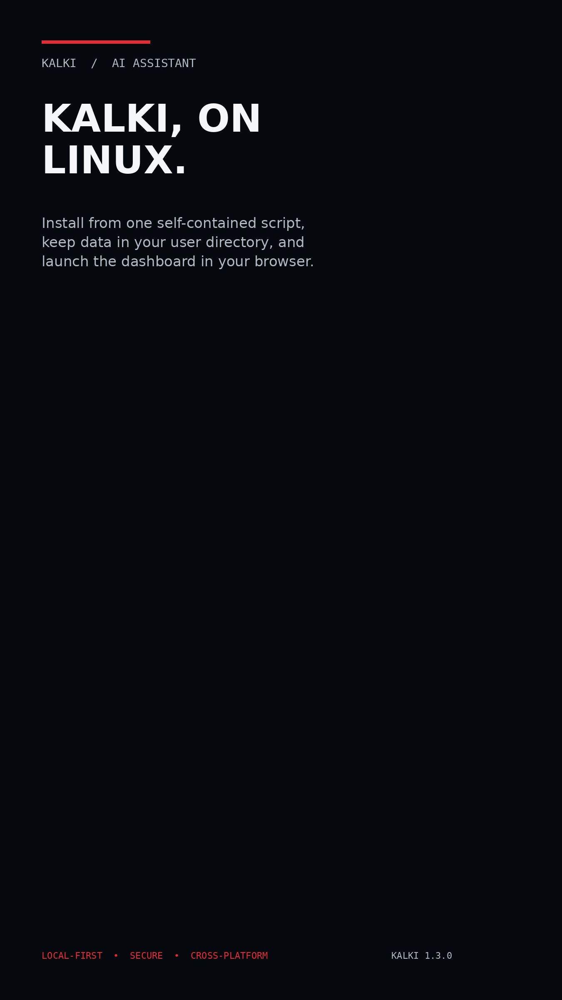

# KALKI AI Assistant

KALKI is a local-first, voice-capable AI desktop assistant with a secure localhost API, responsive HUD dashboard, configurable model providers, memory and task workflows, cybersecurity utilities, and platform-aware system integrations.

Version **1.3.0** focuses on reliable startup, consistent voice identity, protected local APIs, safe user-data storage, improved full-screen behavior, and a practical Linux execution path.

<p align="center">
  
</p>

## Platform status

| Platform | Primary experience | Status |
|---|---|---|
| Windows 10/11 | PyWebView desktop shell with packaged helper services | Validated for v1.3.0 release |
| Linux | Supervised local server with browser-backed dashboard | Validated in an Ubuntu-like sandbox; hardware acceptance pass recommended |
| macOS | Source-compatible runtime path and browser mode | Not claimed as fully validated in this release |

Linux deliberately uses the default browser for the dashboard instead of forcing an unverified GTK/WebKit desktop wrapper. This provides a dependable installation path while preserving the same local server, authenticated API, dashboard, workflows, and configuration model.

## Highlights

KALKI provides a responsive Canvas-based HUD with full-screen and window controls, typed chat, optional browser microphone input, configurable AI providers, local memory, task management, notifications, vision workflows, cybersecurity helpers, and controlled system actions. The default voice identity is the British English neural voice `en-GB-RyanNeural`, used consistently across normal responses, notifications, and workflow modes. Mode context changes delivery and wording without silently changing the configured assistant identity.

The local server binds to loopback and requires the installation-specific `X-KALKI-Token` header for privileged API operations. Host code execution is disabled by default. Destructive or system-changing actions remain guarded by explicit confirmation and platform capability checks.

## Installation

### Windows source development

Install Python 3.11 or newer, create a virtual environment, and install the Windows dependency set:

```powershell
py -3 -m venv .venv
.\.venv\Scripts\Activate.ps1
python -m pip install --upgrade pip
python -m pip install -r app\requirements.txt
python app\main_app.py
```

The first-run setup wizard stores ordinary preferences in the per-user KALKI data directory and credentials in the secure vault. Do not place personal credentials in `config.py` or commit them to Git.

### Linux release

Extract the Linux release archive, enter the extracted directory, and run:

```bash
chmod +x install.sh
./install.sh
```

The installer creates a private virtual environment under `~/.local/share/kalki/venv`, installs `app/requirements-linux.txt`, and writes an XDG desktop entry. The launcher supervises the local server, opens the dashboard at `http://127.0.0.1:<port>/`, and stores mutable data under `$XDG_DATA_HOME/KALKI` or `~/.local/share/KALKI`.

The Linux microphone listener is optional. Continuous listening requires SpeechRecognition, PyAudio, PortAudio, and a visible input device. If those capabilities are unavailable, KALKI skips the failing listener rather than restarting it indefinitely and shows a capability notice in the dashboard. Typed and browser-based workflows remain available. Linux speech uses Edge TTS when available, with `espeak-ng` or `espeak` as a local synthesis fallback and `ffplay`, `mpv`, or `mpg123` as supported playback backends.

For a server without a graphical display, the setup path is headless-safe:

```bash
python app/kalki_setup_wizard.py --headless
```

The headless path creates a safe quick configuration, defaults to push-to-talk, writes the setup marker, and never requires Tkinter.

### Windows release artifacts

The Windows release pipeline creates a portable GitHub ZIP and an unsigned MSIX suitable for Microsoft Store submission. Development signing is intentionally opt-in and is never performed by the default release command. The generated archives and build directories are ignored by Git.

## Campaign gallery

The KALKI campaign is built around a single visual language: graphite-black surfaces, platinum typography, restrained crimson signal accents, and the KALKI eye as a recognizable product anchor. These standalone high-resolution posters are suitable for launch posts, product pages, release announcements, and social promotion.

### Launch and product positioning

<p align="center">
  
  
  
</p>

### Capability stories

<p align="center">
  
  
  
</p>

### Cross-platform and privacy

<p align="center">
  
  
</p>

### Promotional banners

<p align="center">
  <br>
  
</p>

## Configuration

Copying `app/config.example.py` to `app/config.py` is supported for source development, but the application also provisions a writable configuration path when the installation directory is read-only. Runtime paths are resolved centrally by `app/runtime_paths.py`:

| Platform | User data base directory |
|---|---|
| Windows | `%APPDATA%` |
| macOS | `~/Library/Application Support` |
| Linux | `$XDG_DATA_HOME` or `~/.local/share` |

The active configuration loads ordinary user preferences from the per-user KALKI directory and retrieves API credentials from the secure vault. Environment variables remain supported for deployment and local development. Keep provider keys, OAuth credentials, tokens, vault files, and personal memory outside version control.

## Architecture

The application consists of a Python standard-library HTTP server, a static dashboard, optional helper processes, a secure vault, and platform adapters. The Windows entry point uses PyWebView and packaged helper executables. The Linux entry point uses `app/linux_launcher.py` to supervise `server.py` and the optional `listener.py`, while opening the static dashboard in the default browser.

```text
KALKI launcher
    |
    +-- first-run setup wizard / headless setup
    |
    +-- authenticated localhost server
    |       |
    |       +-- static HUD dashboard
    |       +-- AI provider and workflow routes
    |       +-- secure vault and per-user runtime data
    |
    +-- optional microphone listener
    +-- platform-specific adapters and guarded system actions
```

| Path | Purpose |
|---|---|
| `app/main_app.py` | Windows desktop entry point; delegates to Linux browser mode on non-Windows systems |
| `app/linux_launcher.py` | Linux supervisor and browser launcher |
| `app/server.py` | Local HTTP API, dashboard serving, workflows, TTS, and guarded actions |
| `app/listener.py` | Optional continuous microphone listener |
| `app/kalki_setup_wizard.py` | GUI setup wizard and headless-safe setup path |
| `app/runtime_paths.py` | Shared application, configuration, and user-data path resolution |
| `app/core/api_vault.py` | Secure credential storage and migration behavior |
| `app/index.html` | HUD dashboard and browser-side interaction logic |
| `linux/install.sh` | Linux virtual-environment and desktop-entry installer |
| `linux/package_linux.sh` | Portable Linux source-release builder |
| `microsoft_store/release.ps1` | Windows EXE, ZIP, MSIX, and validation pipeline |

## Security model

KALKI is designed for local use and follows a defense-in-depth model. The server uses a per-installation token for privileged requests and rejects unauthenticated access. Browser-origin checks prevent untrusted web pages from calling protected local routes. Credentials are kept out of ordinary configuration exports and are stored through the vault abstraction. Generated host code execution is disabled by default, and system-changing actions are guarded.

The local API should never be exposed through port forwarding, a public reverse proxy, or an untrusted network interface. Treat the token file and runtime data directory as private user data. Before sharing logs or diagnostic archives, remove tokens, credentials, personal memory, task data, and provider responses.

## Testing

The deterministic verification gate can be run from the repository root:

```bash
python app/verification_sandbox.py --report Output/verification.json
python -m unittest app/sandbox_tool_test.py
```

For JavaScript syntax validation, extract each inline script block from `app/index.html` and run `node --check` on the resulting files. The Linux CI workflow performs compilation, dashboard syntax checks, verification tests, tool tests, and Linux archive creation on Ubuntu 24.04.

The v1.3.0 release gates recorded the following results:

| Gate | Result |
|---|---:|
| Windows source verification | 9 passed, 0 failed |
| Windows MSIX validation | 16 passed, 0 warnings, 0 errors |
| Linux source verification | 9 passed, 0 failed |
| Linux tool tests | 10/10 passed |
| Linux headless setup | Passed in a fresh XDG home |
| Linux first-run launcher | Passed without listener restart loop |
| Linux TTS state cleanup | Passed under simulated playback failure |
| Linux package manifest | Passed; no private signing material, caches, bytecode, logs, or mutable data |

A sandbox without a graphical display, physical microphone, or audio device cannot validate human-perceived GUI rendering, microphone capture, or audible playback. Those scenarios require a final acceptance pass on the target workstation.

## Release and CI

The Linux workflow is defined in `.github/workflows/linux.yml`. It validates the source on Ubuntu 24.04 and builds a portable Linux archive. The Windows release workflow is driven by `microsoft_store/release.ps1` and keeps Store packaging separate from optional development signing.

To build the Linux archive locally:

```bash
chmod +x linux/package_linux.sh
linux/package_linux.sh
```

The resulting archive contains the maintained application, Linux installer, documentation, and required assets. It excludes private signing material, runtime data, generated caches, bytecode, logs, and Windows build output.

## Platform boundaries

Some functions are inherently platform-specific and are intentionally guarded rather than falsely advertised as equivalent everywhere. Windows-only integrations include WMI and pycaw hardware/audio control, registry startup, Windows global hotkeys, Windows SAPI, active-browser URL extraction tied to Windows APIs, and Microsoft Store MSIX packaging. Linux users receive capability detection and usable browser or typed workflows when those integrations are unavailable.

## Repository hygiene

Generated environments, downloaded browsers, build trees, packaged executables, MSIX staging files, runtime data, logs, signing certificates, private keys, and release outputs are excluded by `.gitignore`. Only source code, maintained scripts, tests, documentation, and intentional visual assets belong in Git.

## License

KALKI is distributed under the license in [`LICENSE`](LICENSE). Review [`TERMS.md`](TERMS.md) for additional project terms and [`CHANGES.md`](CHANGES.md) for release history.

## References

[1]: https://specifications.freedesktop.org/basedir-spec/latest/ "XDG Base Directory Specification"
[2]: https://docs.python.org/3/library/venv.html "Python virtual environment documentation"
[3]: https://docs.github.com/en/actions "GitHub Actions documentation"
