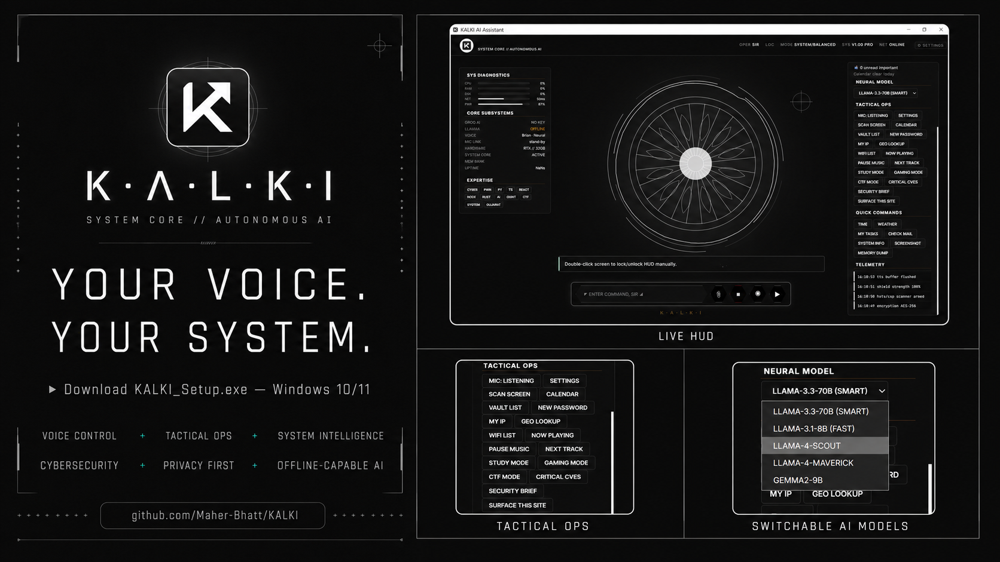
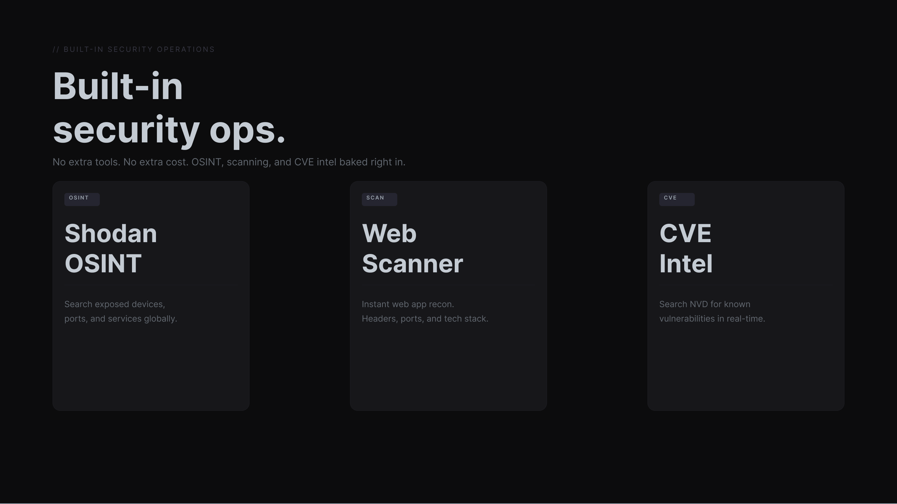
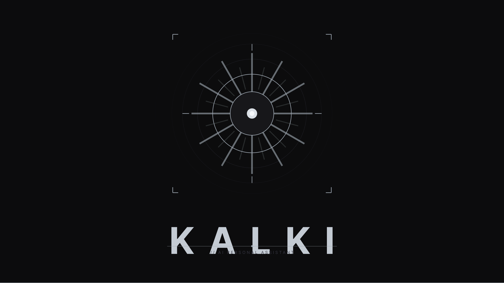
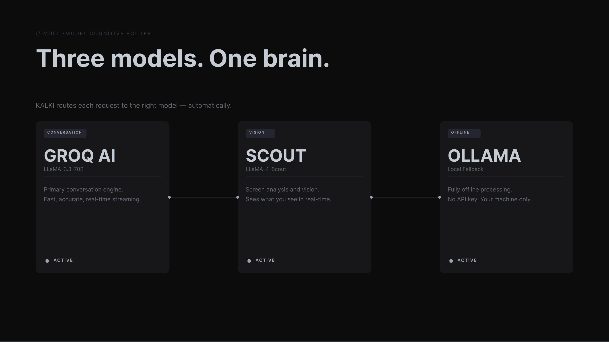
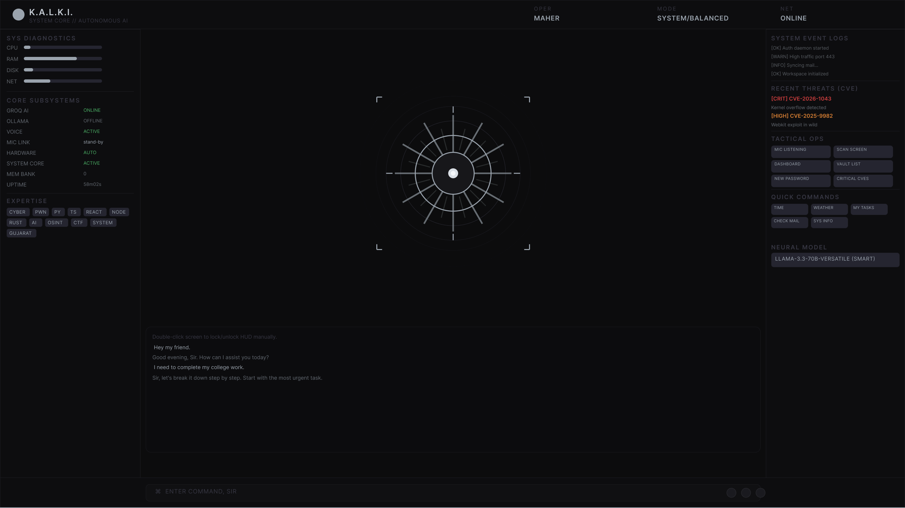
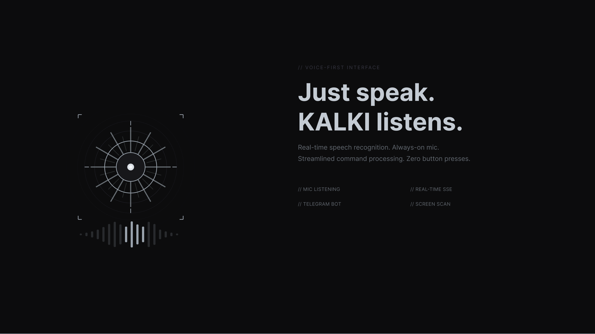
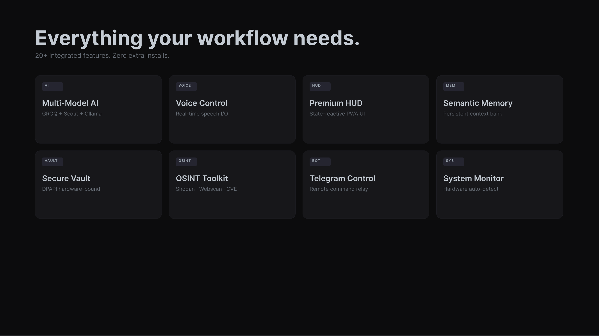
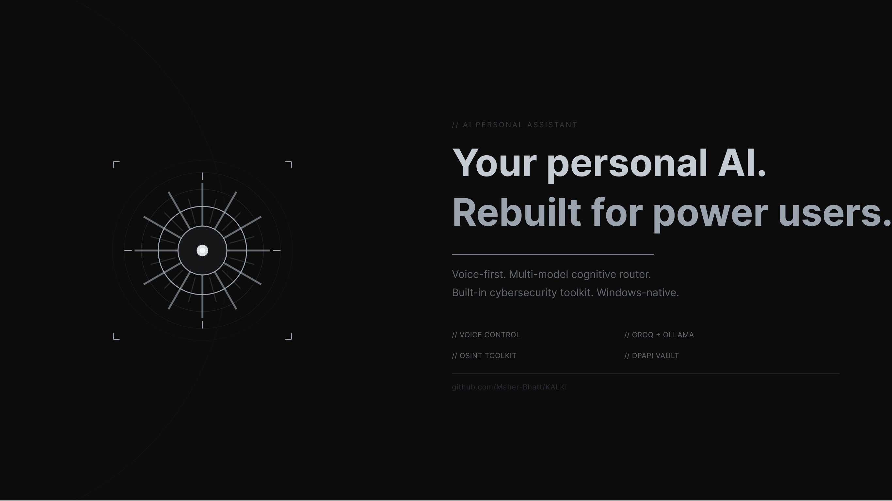

<div align="center">
  

  <br><br>

  <h1> KALKI SYSTEM CORE</h1>

  <strong>The Next-Generation Autonomous AI Command Center for Windows Environments.</strong><br>
  <em>Engineered for Power Users, Developers, and Security Professionals.</em>

  <br><br>

  <p>
    
    
    
    
  </p>

  <br>

  <h3><a href="https://github.com/Maher-Bhatt/KALKI/releases/latest">⬇️ Download KALKI Deployment Package (Latest Release)</a></h3>
  <h4><a href="https://youtu.be/vbUOy8oMqOM" target="_blank">View System Integration Tutorial</a></h4>
</div>

---

## 🚀 Intelligent Autonomy, Redefined.

**KALKI** is not a standard chatbot. It is a fully autonomous, voice-first desktop command center built entirely from the ground up. Operating with a seamless Heads-Up Display (HUD) and powered by the world's fastest inference engines, KALKI manages your entire digital infrastructure—from cybersecurity workflows and system operations to deep-level coding and schedule management.

By seamlessly bridging the gap between natural language and complex operating system execution, KALKI transforms your machine into a proactive, intelligent ecosystem.

<div align="center">
  <table>
    <tr>
      <td>⚡ <strong>Native Performance.</strong> Zero Electron overhead. Pure Canvas2D rendering for sub-millisecond UI response.</td>
      <td>🧠 <strong>Cognitive Architecture.</strong> Built-in dynamic routing selects the optimal LLM for the task at hand.</td>
    </tr>
    <tr>
      <td>🔒 <strong>Zero-Trust Security.</strong> Hardware-bound DPAPI encryption and strict sandbox execution environments.</td>
      <td>⚡ <strong>Unprecedented Speed.</strong> Groq LPU integration delivers 70B parameter reasoning in under 500ms.</td>
    </tr>
  </table>
</div>

---

## 🖼️ Interface & Capabilities

<div align="center">
  
  
  
  <br>
  
  
  
  <br><br>
  
</div>

---

## ⚙️ Enterprise-Grade Feature Suite

### 1. Multi-Model Intelligence Core
KALKI is engineered with a dynamic cognitive router that automatically delegates tasks to the most efficient neural network.
- **DeepSeek-R1 (Free Out-of-the-Box)**: Native integration for extreme technical reasoning and coding directly on installation.
- **LLaMA-3.3-70B (Groq)**: Instantaneous, sub-second responses for system control and logic.
- **Ollama Fallback**: Complete offline autonomy. KALKI detects network drops and routes internally to your GPU.

### 2. Tactical Cybersecurity & Reconnaissance
Equipped with a suite of OSINT and vulnerability analysis tools for security professionals.
- **Deep Webscan**: Voice-triggered headless Chromium audits for SSL, headers, and DOM analysis.
- **Shodan OSINT**: Real-time IP intelligence, open port mapping, and service banner scraping.
- **Live CVE Intel**: Direct integration with the National Vulnerability Database (NVD).

### 3. Developer Workflows & Automation
Automate the mundane and execute code seamlessly.
- **Clipboard AI Injection**: Copy broken code, command KALKI to repair it, and the optimized code is instantly written back.
- **Isolated Execution**: Scripts generated by KALKI run in a heavily monitored, sandboxed environment.
- **GitHub Integration**: Manage repositories, inspect commit histories, and execute CI/CD triggers verbally.

### 4. Seamless OS & Cloud Integration
Total control over your local machine and cloud services.
- **System Orchestration**: Lock interfaces, terminate processes, adjust volume, and navigate the OS hands-free.
- **Google Workspace**: Full two-way synchronization with Calendar and Gmail. Read, create, and dispatch data via voice.
- **Semantic Memory**: A sophisticated long-term fact storage engine, inspectable and manageable via the HUD.

---

## 🔒 Security & Privacy Architecture

We built KALKI with an aggressive Zero-Trust security posture. 
- **Native Sandbox Alerts**: Any attempt to execute a destructive command (process termination, file deletion) triggers a hardware-level Windows Security Alert requiring explicit human authorization.
- **Encrypted Vault**: API keys and secrets are encrypted using the Windows Data Protection API (DPAPI) and native system keyrings.
- **Offline By Design**: When privacy is paramount, switch to the VOSK wake-word engine and Ollama for a 100% air-gapped experience.

---

## 📡 Deployment Instructions

KALKI utilizes an automated, CI/CD-backed deployment pipeline. No manual building required.

1. **Download the Package**: Obtain `KALKI_Setup.exe` from the [Latest Release](https://github.com/Maher-Bhatt/KALKI/releases/latest).
2. **Execute Setup**: The installer handles all dependencies, PATH configurations, and PWA manifest installations.
3. **Initialize**: Launch the application and say **"Hi KALKI"**.
4. **Configure**: Insert your API keys (Groq, Anthropic, or OpenAI) in the Settings Board to unlock maximum performance, or rely on the free DeepSeek-R1 fallback.

---

## 📊 System Requirements

| Component | Minimum Specification (Cloud Routed) | Recommended Specification (Offline AI) |
|:---|:---|:---|
| **Operating System** | Windows 10 / 11 (64-bit architecture) | Windows 11 (64-bit architecture) |
| **Processor (CPU)** | Intel Core i3 / AMD Ryzen 3 | Intel Core i5 / AMD Ryzen 5+ |
| **Memory (RAM)** | 4 GB DDR4 | 16 GB+ DDR4/DDR5 |
| **Graphics (GPU)** | Integrated Graphics | NVIDIA RTX 3060+ / 8GB VRAM |
| **Storage** | 2 GB Available Space (SSD) | 15 GB+ NVMe SSD |

---

## 🏗️ System Architecture

KALKI decouples its complex Python computational backend from its lightweight JavaScript frontend, ensuring zero UI latency during heavy inference workloads.

```text
[ Speech Interface ] ──▶ [ Python Core Engine ] ──▶ [ Cognitive Router ]
                              │          │                 │
      [ VOSK / STT ] ◀────────┘          │                 ▼
                                         ▼        [ Groq / DeepSeek / Ollama ]
[ Heads-Up Display ] ◀──────── [ Tool Executors ]
  (Canvas2D HUD)               (OS / Web / Cyber)
```

---

## ⚖️ Legal & Licensing

Copyright © 2026 Maher Bhatt. All rights reserved.

KALKI is distributed under the **MIT License**. See the [LICENSE](LICENSE) file for details. Installation and usage are governed by the conditions outlined in [TERMS.md](TERMS.md), which mandate responsible use of the integrated cybersecurity and automation features.

<div align="center">
  <br>
  <strong>Engineered by <a href="https://github.com/Maher-Bhatt">Maher Bhatt</a></strong><br>
  <em>Next-Generation Intelligence.</em>
</div>
