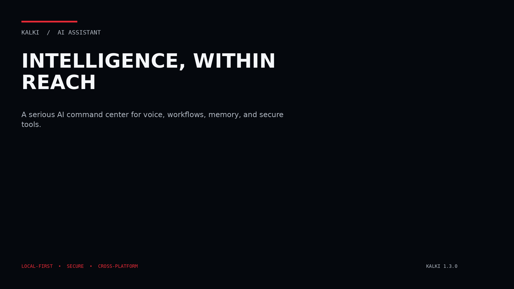
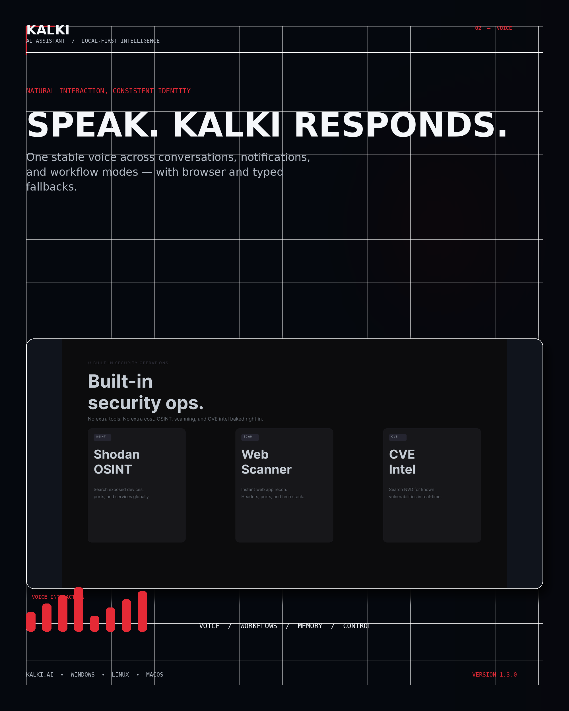
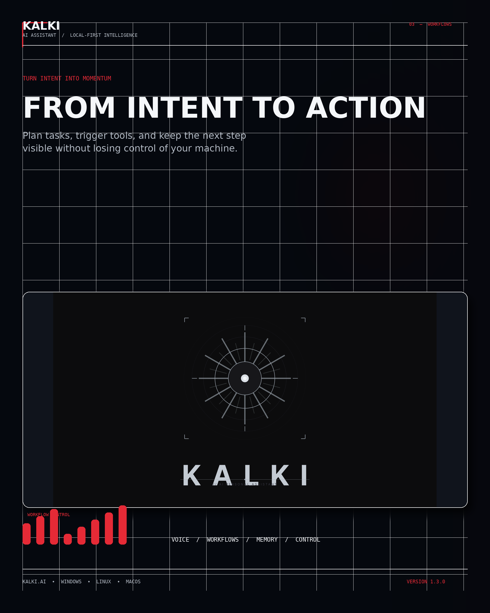
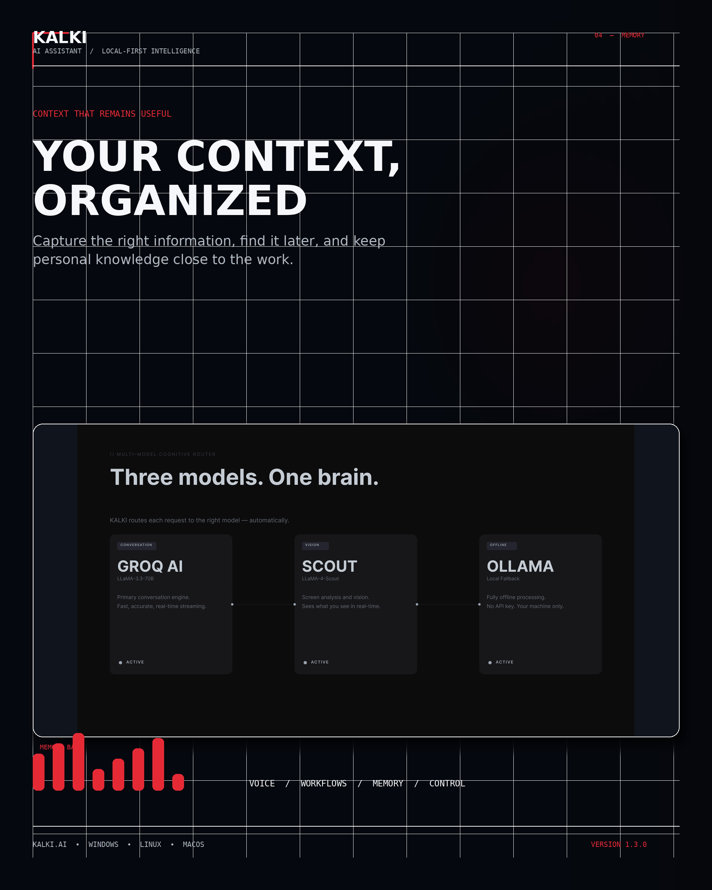
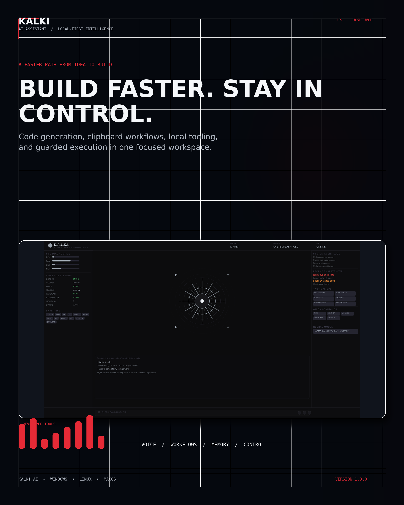
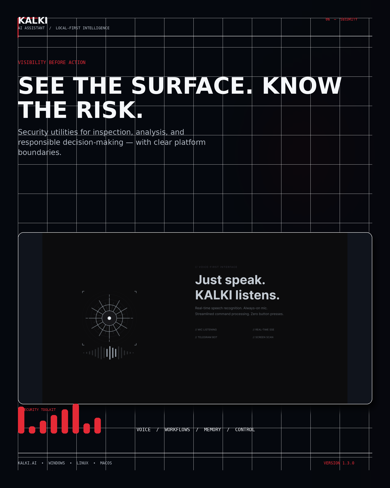
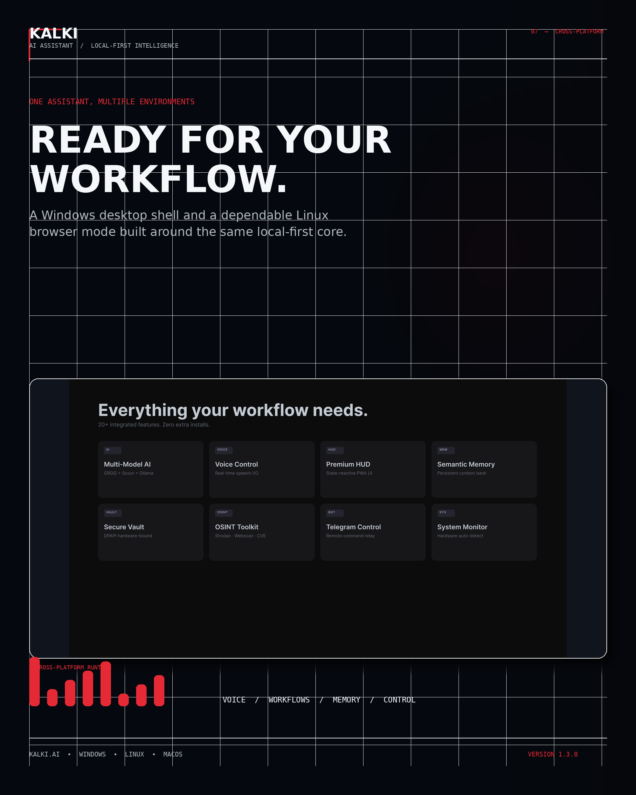
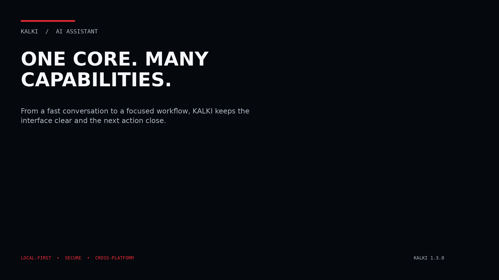
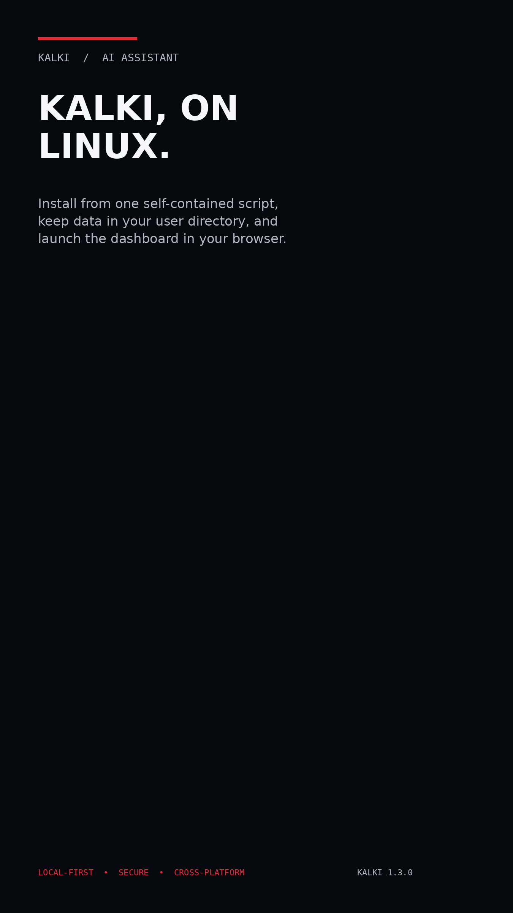

# KALKI AI Assistant

KALKI is a local-first, voice-capable AI desktop assistant with a secure localhost API, a rebuilt personal-workspace interface, configurable model providers, memory and task workflows, cybersecurity utilities, and platform-aware system integrations. Version **2.0.0** replaces the previous HUD dashboard with **Filament**: a five-destination workspace (Ask, Today, Memory, Workbench, Settings) built as a 27-module, no-build-step frontend, with a command palette as a core interaction system and a single warm-platinum presence mark that lives in the navigation rail rather than at screen center.

Version **2.0.0** focuses on the frontend and its packaging: a maintainable module structure in place of one 2,529-line HTML file, exposure of the roughly two-thirds of KALKI's API surface the previous interface never surfaced, a gated cybersecurity workspace, an honest voice-state model that never claims a state the backend cannot confirm, and a corrected static-asset route and service-worker caching policy so the packaged app can actually receive frontend updates. The backend, voice pipeline, and memory system are unchanged in substance.


<p align="center">
  
</p>

## Platform status

| Platform | Primary experience | Status |
|---|---|---|
| Windows 10/11 | Native-framed PyWebView desktop shell with packaged helper services | Backend validated for v1.3.5; v2.0.0 frontend validated in a Node/jsdom harness (see below) — target-device acceptance still recommended |
| Linux | Supervised local server with browser-backed dashboard | Validated in an Ubuntu-like sandbox; hardware acceptance pass recommended |
| macOS | Source-compatible runtime path and browser mode | Not claimed as fully validated in this release |

Linux deliberately uses the default browser for the dashboard instead of forcing an unverified GTK/WebKit desktop wrapper. This provides a dependable installation path while preserving the same local server, authenticated API, dashboard, workflows, and configuration model.

## Highlights

KALKI's interface is a five-destination workspace — Ask, Today, Memory, Workbench, and a gated Security surface — with a keyboard-first command palette reachable from anywhere (`Ctrl/Cmd+K`), native window controls, streaming chat with markdown and code rendering, attachments, and a real conversation history stored client-side in IndexedDB (the backend has no conversation database; `history.json` is the model's rolling 10-exchange context window, which the composer states honestly rather than hiding). The default voice identity is the British English neural voice `en-GB-RyanNeural`, used consistently across normal responses, notifications, and workflow modes. Mode context changes delivery and wording without silently changing the configured assistant identity. Voice state in the interface is deliberately conservative: it shows only what the backend can actually confirm (ready, attending, thinking, speaking, interrupted) rather than an unverifiable "listening" indicator.

The local server binds to loopback and requires the installation-specific `X-KALKI-Token` header for privileged API operations. Host code execution is disabled by default. Destructive or system-changing actions remain guarded by explicit confirmation and platform capability checks.

## Installation

### Windows source development

Install Python 3.11 or newer, create a virtual environment, and install the Windows dependency set:

```powershell
py -3 -m venv .venv
.\.venv\Scripts\Activate.ps1
python -m pip install --upgrade pip
python -m pip install -r app\requirements.txt
python app\main_app.py
```

The first-run setup wizard stores ordinary preferences in the per-user KALKI data directory and credentials in the secure vault. Do not place personal credentials in `config.py` or commit them to Git.

### Linux release

Extract the Linux release archive, enter the extracted directory, and run:

```bash
chmod +x install.sh
./install.sh
```

The installer creates a private virtual environment under `~/.local/share/kalki/venv`, installs `app/requirements-linux.txt`, and writes an XDG desktop entry. The launcher supervises the local server, opens the dashboard at `http://127.0.0.1:<port>/`, and stores mutable data under `$XDG_DATA_HOME/KALKI` or `~/.local/share/KALKI`.

The Linux microphone listener is optional. Continuous listening requires SpeechRecognition, PyAudio, PortAudio, and a visible input device. If those capabilities are unavailable, KALKI skips the failing listener rather than restarting it indefinitely and shows a capability notice in the dashboard. Typed and browser-based workflows remain available. Linux speech uses Edge TTS when available, with `espeak-ng` or `espeak` as a local synthesis fallback and `ffplay`, `mpv`, or `mpg123` as supported playback backends.

For a server without a graphical display, the setup path is headless-safe:

```bash
python app/kalki_setup_wizard.py --headless
```

The headless path creates a safe quick configuration, defaults to push-to-talk, writes the setup marker, and never requires Tkinter.

### Windows release artifacts

The Windows release pipeline creates a standalone EXE, a portable GitHub ZIP, and an unsigned MSIX suitable for Microsoft Store submission. Version 1.3.5 uses the native Windows frame and conservative WebView2 rendering, and the installer stops KALKI helper processes before replacing locked files. Development signing is intentionally opt-in and is never performed by the default release command. The generated archives and build directories are ignored by Git.

## Campaign gallery

The images below are from KALKI's earlier promotional campaign and reflect the *previous* visual identity — graphite-black surfaces, platinum typography, and the KALKI eye as a product anchor. They predate the v2.0.0 Filament rebuild and have not been regenerated as part of this release; producing new campaign artwork aligned to Filament (warm-platinum presence mark, no eye motif) is a separate follow-up, not a source-code task. The images remain here for continuity with existing posts and are not a claim about the current interface.

### Launch and product positioning

<p align="center">
  
  
  
</p>

### Capability stories

<p align="center">
  
  
  
</p>

### Cross-platform and privacy

<p align="center">
  
  
</p>

### Promotional banners

<p align="center">
  <br>
  
</p>

## Configuration

Copying `app/config.example.py` to `app/config.py` is supported for source development, but the application also provisions a writable configuration path when the installation directory is read-only. Runtime paths are resolved centrally by `app/runtime_paths.py`:

| Platform | User data base directory |
|---|---|
| Windows | `%APPDATA%` |
| macOS | `~/Library/Application Support` |
| Linux | `$XDG_DATA_HOME` or `~/.local/share` |

The active configuration loads ordinary user preferences from the per-user KALKI directory and retrieves API credentials from the secure vault. Environment variables remain supported for deployment and local development. Keep provider keys, OAuth credentials, tokens, vault files, and personal memory outside version control.

## Architecture

The application consists of a Python standard-library HTTP server, a static dashboard, optional helper processes, a secure vault, and platform adapters. The Windows entry point uses PyWebView and packaged helper executables. The Linux entry point uses `app/linux_launcher.py` to supervise `server.py` and the optional `listener.py`, while opening the static dashboard in the default browser.

```text
KALKI launcher
    |
    +-- first-run setup wizard / headless setup
    |
    +-- authenticated localhost server
    |       |
    |       +-- static HUD dashboard
    |       +-- AI provider and workflow routes
    |       +-- secure vault and per-user runtime data
    |
    +-- optional microphone listener
    +-- platform-specific adapters and guarded system actions
```

| Path | Purpose |
|---|---|
| `app/main_app.py` | Windows desktop entry point; delegates to Linux browser mode on non-Windows systems |
| `app/linux_launcher.py` | Linux supervisor and browser launcher |
| `app/server.py` | Local HTTP API, dashboard serving, workflows, TTS, and guarded actions |
| `app/listener.py` | Optional continuous microphone listener |
| `app/kalki_setup_wizard.py` | GUI setup wizard and headless-safe setup path |
| `app/runtime_paths.py` | Shared application, configuration, and user-data path resolution |
| `app/core/api_vault.py` | Secure credential storage and migration behavior |
| `app/index.html` | Frontend shell (41 lines): boot screen, `<div id="app">`, loads `/ui/main.js` |
| `app/ui/` | The application itself — 27 ES modules (shell, ask, today, memory, workbench, security, settings, palette, router) plus the Filament design tokens. No build step; served directly by `server.py`'s `/ui/*` route |
| `app/service-worker.js` | Network-only for the API and HTML shell, network-first for `/ui/*`, stale-while-revalidate for other assets |
| `linux/install.sh` | Linux virtual-environment and desktop-entry installer |
| `linux/package_linux.sh` | Portable Linux source-release builder |
| `microsoft_store/release.ps1` | Windows EXE, ZIP, MSIX, and validation pipeline |

## Security model

KALKI is designed for local use and follows a defense-in-depth model. The server uses a per-installation token for privileged requests and rejects unauthenticated access. Browser-origin checks prevent untrusted web pages from calling protected local routes. Credentials are kept out of ordinary configuration exports and are stored through the vault abstraction. Generated host code execution is disabled by default, and system-changing actions are guarded.

The local API should never be exposed through port forwarding, a public reverse proxy, or an untrusted network interface. Treat the token file and runtime data directory as private user data. Before sharing logs or diagnostic archives, remove tokens, credentials, personal memory, task data, and provider responses.

No signing certificate ships in this repository. Local development signing of the MSIX package resolves `KALKI_DEV_CERT_PATH` and `KALKI_DEV_CERT_PASSWORD` from the environment rather than from a committed `.pfx`; building with neither set produces an unsigned package, which is what Microsoft Partner Center expects to receive for submission.

The `/ui/*` static route added in v2.0.0 serves only files under `app/ui/`, resolved through `os.path.realpath` and checked against that directory's prefix before anything is read, and only recognized frontend file extensions are served — anything else, or any path that resolves outside `app/ui/`, returns 404.

## Testing

The deterministic verification gate can be run from the repository root:

```bash
python app/verification_sandbox.py --report Output/verification.json
python -m unittest app/sandbox_tool_test.py
```

For frontend validation, every file under `app/ui/` is a real ES module — check syntax and confirm every import resolves to a real export with:

```bash
node --experimental-vm-modules .github/scripts/validate-ui-modules.mjs
```

The Linux CI workflow performs Python compilation, this frontend module check, verification tests, tool tests, and Linux archive creation on Ubuntu 24.04.

The v1.3.5 release gates recorded the following results, which remain valid for the backend surface this release does not modify:

| Gate | Result |
|---|---:|
| Windows source verification | 9 passed, 0 failed; 57 Python files compiled |
| Windows MSIX validation | 16 passed, 0 warnings, 0 errors; package identity 1.3.5.0 |
| Linux source verification | 9 passed, 0 failed |
| Linux tool tests | 10/10 passed |
| Linux headless setup | Passed in a fresh XDG home |
| Linux first-run launcher | Passed without listener restart loop |
| Linux TTS state cleanup | Passed under simulated playback failure |
| Linux package manifest | Passed; no private signing material, caches, bytecode, logs, or mutable data |

A sandbox without a graphical display, physical microphone, or audio device cannot validate human-perceived GUI rendering, microphone capture, or audible playback. Those scenarios require a final acceptance pass on the target workstation.

#### v2.0.0 & v2.1.0 frontend validation

The v2.0.0 frontend rebuild and v2.1.0 additive oversight features were validated in a sandbox with Node.js but no browser and no Windows/Linux GUI, so the scope below is what was actually exercised — not a claim that a target-device acceptance pass is unnecessary:

| Check | Method | Result |
|---|---|---|
| Every `app/ui/*.js` module parses and every import resolves to a real export | `node --experimental-vm-modules .github/scripts/validate-ui-modules.mjs` | 28/28 modules clean |
| `server.py` and `build_msix.py` still parse after patching | `python -m ast` | Both parse |
| Directory-traversal guard on the new `/ui/*` route | Manual requests for `/ui/../server.py` and its percent-encoded form | Both return 404 |
| Full user journeys — boot, streaming chat, command palette, memory CRUD, tasks, settings, workflows, gated security, oversight, keyboard navigation, offline/recovery | Real `app/ui/main.js` loaded via Node's module loader against a jsdom document and a stub HTTP server reproducing the actual API response shapes | Passed, zero uncaught console errors |

Target-device acceptance for v2.1.0 includes ensuring `oversight.py` and `notify.py` are properly packaged by PyInstaller to prevent background thread crashes, and that zombie WebView2 instances are cleared to prevent IndexedDB locking upon boot.

## Release and CI

The Linux workflow is defined in `.github/workflows/linux.yml`. It validates the source on Ubuntu 24.04 and builds a portable Linux archive. The Windows release workflow is driven by `microsoft_store/release.ps1` and keeps Store packaging separate from optional development signing.

To build the Linux archive locally:

```bash
chmod +x linux/package_linux.sh
linux/package_linux.sh
```

The resulting archive contains the maintained application, Linux installer, documentation, and required assets. It excludes private signing material, runtime data, generated caches, bytecode, logs, and Windows build output.

## Platform boundaries

Some functions are inherently platform-specific and are intentionally guarded rather than falsely advertised as equivalent everywhere. Windows-only integrations include WMI and pycaw hardware/audio control, registry startup, Windows global hotkeys, Windows SAPI, active-browser URL extraction tied to Windows APIs, and Microsoft Store MSIX packaging. Linux users receive capability detection and usable browser or typed workflows when those integrations are unavailable.

## Repository hygiene

Generated environments, downloaded browsers, build trees, packaged executables, MSIX staging files, runtime data, logs, signing certificates, private keys, and release outputs are excluded by `.gitignore`. Only source code, maintained scripts, tests, documentation, legal terms, and intentional visual assets belong in Git — no signing certificate ships in this repository; see the Security model section above. The v2.0.0 Store package is validated locally but receives production signing and certification through Microsoft Partner Center.

## License

KALKI is distributed under the license in [`LICENSE`](LICENSE). Review [`TERMS.md`](TERMS.md) for responsible-use and distribution terms, [`PRIVACY.md`](PRIVACY.md) for data-handling information, and [`CHANGES.md`](CHANGES.md) for release history.

## References

[1]: https://specifications.freedesktop.org/basedir-spec/latest/ "XDG Base Directory Specification"
[2]: https://docs.python.org/3/library/venv.html "Python virtual environment documentation"
[3]: https://docs.github.com/en/actions "GitHub Actions documentation"
